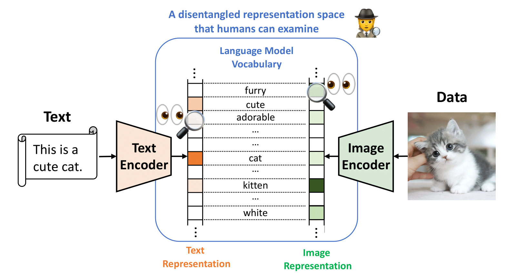

# VDR: Vocabulary Disentangled Retriever

[](https://github.com/jzhoubu/VDR/blob/master/LICENSE)


This repository includes the official implemetation of [**VDR: Retrieval-based Disentangled Representation Learning with Natural Language Supervision**](https://openreview.net/pdf?id=ZlQRiFmq7Y). 

**VDR (Vocabulary Disentangled Retrieval)** learns disentangled representations of multimodal data (e.g., text, image) within a language model vocabulary space, enabling explainable and transparent search functionality. 

<div align=center>
    
</div>

Additionally, I am hosting an open-source repository [**vsearch**](github.com/jzhoubu/vsearch), which focuses on retrieval with new functionality for retrieval-augmented LLMs and will be maintained long-term. This repository emphasizes reproducing results from the VDR paper and exploring multimodal topics.

## 🗺 Overview

1. [Preparation](#-preparation)
    - Setup Environment
    - Download Data

2. [Quick Start](#-quick-start)
    - Text-to-text Retrieval
    - Cross-modal Retrieval
    - Disentanglement and Reasoning

3. [Training](#-training)

## 💻 Preparation

### Setup Environment via Poetry

```
# install poetry first
# curl -sSL https://install.python-poetry.org | python3 -
poetry install
poetry shell
```

### Download Data

Download data using identifiers in `conf/data_stores/*.yaml`.

```bash
# Download a single dataset file
python download.py nq_train
# Download multiple dataset files:
python download.py nq_train trivia_train
# Download all dataset files:
python download.py all
```


<!--
<details>
<summary>Testing</summary>

```bash
python -m test.quick_start
# Expected Ouput:
# tensor([[91.1257, 17.6930, 13.0358, 12.4576]], device='cuda:0')
# tensor([[0.3209, 0.0984]])
```
</details>
-->

## 🚀 Quick Start

## Text-to-text Retrieval

```python
import torch
from src.ir import Retriever

# Define a query and a list of passages
query = "Who first proposed the theory of relativity?"
passages = [
    "Albert Einstein (14 March 1879 – 18 April 1955) was a German-born theoretical physicist who is widely held to be one of the greatest and most influential scientists of all time. He is best known for developing the theory of relativity.",
    "Sir Isaac Newton FRS (25 December 1642 – 20 March 1727) was an English polymath active as a mathematician, physicist, astronomer, alchemist, theologian, and author who was described in his time as a natural philosopher.",
    "Nikola Tesla (10 July 1856 – 7 January 1943) was a Serbian-American inventor, electrical engineer, mechanical engineer, and futurist. He is known for his contributions to the design of the modern alternating current (AC) electricity supply system."
]

# Initialize the retriever
vdr_nq = Retriever.from_pretrained("vsearch/vdr-nq")
vdr_nq = vdr_nq.to("cuda")

# Embed the query and passages
q_emb = vdr_nq.encoder_q.embed(query)  # Shape: [1, V]
p_emb = vdr_nq.encoder_p.embed(passages)  # Shape: [4, V]

 # Query-passage Relevance
scores = q_emb @ p_emb.t()
print(scores)

# Output: 
# tensor([[44.5316, 17.0918, 11.8179]], device='cuda:0')
```


## Multi-modal Retrieval

```python
import torch
from src.ir import Retriever

# Define a query and a list of passages
query = "Curiosity was launched to explore Mars"
images = [
    "./examples/images/mars.png"
    "./examples/images/moto.png"
]

# Initialize the retriever
vdr_cm = Retriever.from_pretrained("vsearch/vdr-cross-modal")
vdr_cm = vdr_cm.to("cuda")

# Embed the query and passages
q_emb = vdr_cm.encoder_q.embed(query)  # q for text; shape: [1, V]
p_emb = vdr_cm.encoder_p.embed(images)  # p for image; shape: [4, V]

# Query-passage Relevance
scores = q_emb @ p_emb.t()
print(scores)

# Output: 
# tensor([[0.2700, 0.0942]], device='cuda:0')
```


##  Disentanglement and Reasoning

```python
import torch
from src.ir import Retriever

query = "Who first proposed the theory of relativity?"
passages = [
    "Albert Einstein (14 March 1879 – 18 April 1955) was a German-born theoretical physicist who is widely held to be one of the greatest and most influential scientists of all time. He is best known for developing the theory of relativity.",
    "Sir Isaac Newton FRS (25 December 1642 – 20 March 1727) was an English polymath active as a mathematician, physicist, astronomer, alchemist, theologian, and author who was described in his time as a natural philosopher.",
    "Nikola Tesla (10 July 1856 – 7 January 1943) was a Serbian-American inventor, electrical engineer, mechanical engineer, and futurist. He is known for his contributions to the design of the modern alternating current (AC) electricity supply system."
]

# Initialize the retriever
vdr_nq = Retriever.from_pretrained("vsearch/vdr-nq")
vdr_nq = vdr_nq.to("cuda")
```

### Visualize Disentangled Representation

Shows how each token in the vocabulary is reflected by the data representation. A higher value indicates greater importance of the token in relation to the data.

```python
dst_result = vdr_nq.encoder_q.dst(query, topk=768, visual=True) # Display a word cloud for visualization if `visual`=True
print(dst_result)

# Output: 
# {
#     'relativity': 2.4437570571899414, 
#     'who': 1.6928174495697021,
#     'first': 1.433447003364563, 
#     'theory': 1.3035954236984253,
#     ...
# }
```

<p align="center">
  
</p>


### Reasoning Retrieval Result

Display how each token in the vocabulary contributes to the relevance between the query and passage. The higher the value, the more important the token is to the query-passage relevance.

```python
reasons = vdr_nq.explain(q=query, p=passages[0], topk=768, visual=True)
print(reasons)

# Output: 
# {
#     'relativity': 25.113131280595553, 
#     'theory': 4.43358649649258,
#     'theories': 0.5317612238794851,
#     ...
# }
```

<p align="center">
  
</p>


## 👾 Training
We are testing on `python==3.9` and `torch==2.2.1`. Configuration is handled through `hydra==1.3.2`.

```bash
EXPERIMENT_NAME=test
python -m torch.distributed.launch --nnodes=1 --nproc_per_node=4 train_vdr.py \
hydra.run.dir=./experiments/${EXPERIMENT_NAME}/train \
train=vdr_nq \
data_stores=wiki21m \
train_datasets=[nq_train]
```
- `--hydra.run.dir`: Directory where training logs and outputs will be saved
- `--train`: Identifier for the training config,  in `conf/train/*.yaml`.
- `--data_stores`: Identifier for the datastore, in `conf/data_stores/*.yaml`.
- `--train_datasets`: List of identifiers for the training datasets to be used, in `data_stores`


<!--
During training, we display `InfoCard` to monitor the training progress. 

> [!TIP]
> <details><summary>What is <b><span style="color: blue;">InfoCard</span></b>?</summary>
>
> `InfoCard` is a organized log generated during the training that helps us visually track the progress.  
> 
> An `InfoCard` looks like this:
>
> 
> 
> **InfoCard Layout**
> 
> 1. Global Variables (`V(q)`, `V(p)`, etc.):
>    - Shape: Displays the dimensions of the variable matrix.
>    - Gate: Indicates the sparsity by showing the ratio of non-zero activations.
>    - Mean, Max, Min: Statistical measures of the data distribution within the variable.
> 
> 2. `EXAMPLE` Section:
>    - Contains one sample from the training batch, including query text (`Q_TEXT`), positive passages (`P_TEXT1`), negative passage (`P_TEXT2`), and the correct answer (`ANSWER`).
> 
> 3. Token Triple Sections (`V(q)`, `V(p)`, `V(p_neg)`, `V(q) * V(p)`), which provided token-level impact:
>    - Token (`t`): The specific vocabulary token.
>    - Query Rank (`qrank`): Rank of the token in the query representation.
>    - Passage Rank (`prank`): Rank of the token in the passage representation.
-->


## 🍉 Citation
If you find this repository useful, please consider giving ⭐ and citing our paper:
```
@inproceedings{
  zhou2024retrievalbased,
  title={Retrieval-based Disentangled Representation Learning with Natural Language Supervision},
  author={Jiawei Zhou and Xiaoguang Li and Lifeng Shang and Xin Jiang and Qun Liu and Lei Chen},
  booktitle={The Twelfth International Conference on Learning Representations},
  year={2024},
  url={https://openreview.net/forum?id=ZlQRiFmq7Y}
}
```
